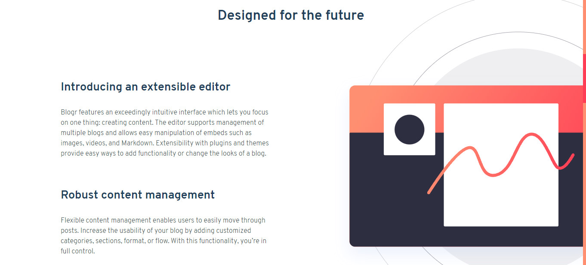

# Frontend Mentor - Blogr landing page solution

This is a solution to the [Blogr landing page challenge on Frontend Mentor](https://www.frontendmentor.io/challenges/blogr-landing-page-EX2RLAApP).

## Table of contents

- [Overview](#overview)
  - [The challenge](#the-challenge)
  - [Screenshot](#screenshot)
  - [Links](#links)
- [My process](#my-process)
  - [Built with](#built-with)
  - [What I learned](#what-i-learned)
  - [Continued development](#continued-development)
  - [Useful resources](#useful-resources)
- [Author](#author)

## Overview

### The challenge

Users should be able to:

- View the optimal layout for the site depending on their device's screen size
- See hover states for all interactive elements on the page

### Screenshot

### Links

- [Solution URL](https://your-solution-url.com)
- [Live Site URL](https://your-live-site-url.com)

## My process

### Built with

- Semantic HTML5 markup
- CSS custom properties
- Flexbox
- CSS Grid
- Mobile-first workflow
- Navbars and dropdowns

### What I learned

This challenge really tested my HTML & CSS a lot! it was tricky to get the layouts especially the navbar for both the desktop and mobile view. I also learned how to use gradients and how to position background images with the gradients. Super happy with how responsive it came out in the end!  

### Continued development

For future plans for now its to do more and more javascript. I just recently finished a course for it and i want to use my new hand skills and make amazing projects. I am super glad frontend mentor exists. I might study a framework or start a little bit on the backend. In fact i was considering looking up a few videos on using Figma and learn how to design proper websites.

### Useful resources

- [net ninja](https://netninja.dev/courses) - This helped me for Studying javascript. I really liked this course and i highly recommend to begginers.
- [Kevin Powell](https://www.youtube.com/kepowob) - This person is extremely talented and has helped me learn most of the things i know in CSS. highly recommend to anyone who is studying CSS.

## Author

- Frontend Mentor - [@mohsin316](https://www.frontendmentor.io/profile/mohsin316)
- Twitter - [@Mohsin_316](https://twitter.com/Mohsin_316)
- Instagram - [@mohsin.k21](https://www.instagram.com/mohsin.k21/)

